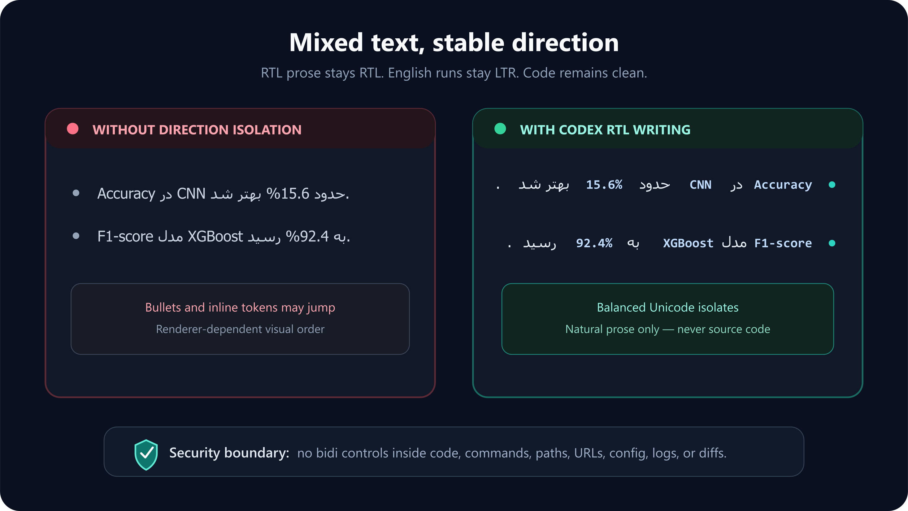

# Codex RTL Writing

[](LICENSE)
[](#security)

A small, zero-dependency Codex skill for readable right-to-left responses in Persian (Farsi), Arabic, Urdu, Dari, Pashto, and Kurdish Sorani, including text mixed with English words, numbers, and technical identifiers.

> This is an independent community project. It is not affiliated with, endorsed by, or supported by OpenAI.



## Features

Codex RTL Writing keeps conversational RTL paragraphs correctly aligned even when a sentence starts with English text or a number. It isolates English terms, acronyms, versions, percentages, inline code, and links so they remain readable inside an RTL sentence; keeps punctuation at the natural end of the sentence; and prevents list bullets from jumping to the wrong side. It never changes code blocks, commands, paths, URLs, configuration, logs, diffs, project files, Codex settings, or account data.

<div dir="rtl">

این skill پاسخ‌های فارسی و دیگر زبان‌های راست‌به‌چپ مبتنی بر خط عربی را مرتب و راست‌چین نگه می‌دارد؛ حتی اگر جمله با کلمهٔ انگلیسی یا عدد شروع شود. عبارت‌های انگلیسی، مخفف‌ها، نسخه‌ها، درصدها، کدهای کوتاه و لینک‌ها داخل همان جمله خوانا باقی می‌مانند، نقطه در انتهای طبیعی جمله قرار می‌گیرد و نشانه‌های فهرست به سمت اشتباه نمی‌روند. این skill هیچ تغییری در کد، فایل‌های پروژه، تنظیمات Codex یا اطلاعات حساب ایجاد نمی‌کند.

</div>

## Install

### Install with Codex

Send this exact request to Codex:

```text
Install the skill from https://github.com/mahdie-sln/codex-rtl-writing
```

After installation, restart Codex or open a new task so the skill catalog refreshes.

### Install manually

Windows PowerShell:

```powershell
git clone https://github.com/mahdie-sln/codex-rtl-writing.git "$env:USERPROFILE\.codex\skills\codex-rtl-writing"
```

macOS or Linux:

```bash
git clone https://github.com/mahdie-sln/codex-rtl-writing.git "$HOME/.codex/skills/codex-rtl-writing"
```

Then restart Codex or open a new task.

## Use

The skill can activate automatically when Codex writes a supported RTL language. To invoke it explicitly, include:

```text
$codex-rtl-writing
```

No background application, administrator access, browser extension, or runtime dependency is required.

## Security

The skill applies balanced Unicode bidi isolates only to rendered conversational prose. It forbids bidi controls inside source code and other machine-readable or exact-copy content. The repository itself contains no literal bidi control characters and includes a zero-dependency validator:

```powershell
node validate.mjs
```

See [SECURITY.md](SECURITY.md) for the complete boundary and reporting policy.

## Remove

Removing this directory uninstalls only the skill and does not affect Codex, projects, accounts, or conversations.

Windows PowerShell:

```powershell
Remove-Item -LiteralPath "$env:USERPROFILE\.codex\skills\codex-rtl-writing" -Recurse
```

macOS or Linux:

```bash
rm -rf "$HOME/.codex/skills/codex-rtl-writing"
```

## License

[MIT](LICENSE)
